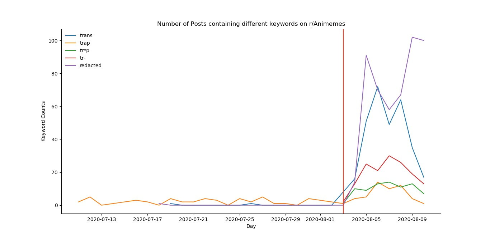
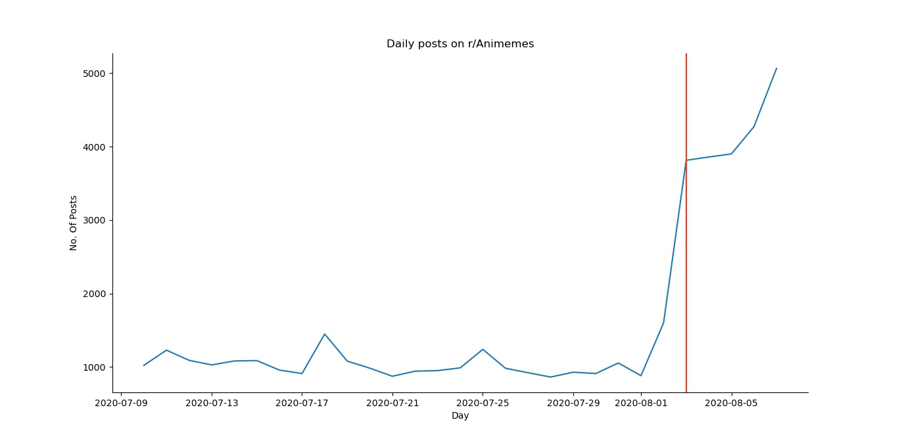

# r/Animemes Viva La Revolution

On 3rd August 2020, Mods of r/Animemes [banned the word 'Trap'](https://www.reddit.com/r/Animemes/comments/i2mn3g/rule_5_update_as_of_today_the_word_trap_is_now/) from the subbreddit. It was implemented effective immediately without consulting the community. This made members of r/Animemes community very angry.

They started revoluting against mods by posting Memes and long threads.

## What is a trap? And why did mods ban the word?
Urban Dictionary defines Trap as: 
>A crossdresser, usually a fictional character in an anime, who dresses up in the opposite gender's clothing to trick people into thinking that they're the opposite gender. Term comes from the anime trope of a character dressing up in drag to trick people into thinking that they're the opposite gender.

>Not to be confused with transgenderism, which is a person transitioning to the opposite gender.

Source: [Urban Dictionary](https://www.urbandictionary.com/define.php?term=Trap)

Mods argue that this is a slur often used against the Transgender community. Many Trans redditors have denied such claims.

## What is this repo about?
I respect the LGBTQ+ and Trans community but I think in this "blanket ban" must be removed. I wondered if it was difficult for mods to implement a ban based on used of the word. 

So, I decided to plot the graph of the word "Trap" used in the past month in comments and posts on r/Animemes. So I wrote a Python script to get all the comments and posts with various words and plotted the grap using `matplotlib`.

## My Findings
I found that the word "Trap" was very rarely used(<100 per day) by the use of word skyrocketed after the ban. Similarly, other words like `tr--`, `trans`, `tr*p`, `redacted` which were meant to just bypass the ban as they mostly refer to trap (except trans, idk about if `trans` refers to trap or not, sorry). 

Similar relation can be seen in the Post title also. The use or words increased after the ban (red line)

There were many memes about how lurkers are even started to post after the ban. I was excited to check this. And I found that typically there are ~1000 posts daily (with ocassional rise due to famous anime episode releases). But after the ban, Post frequencies increased around 2-4 times in just two days. 

We can see slight bumps in the graph but a sudden increase in posts. Its been just 1 week since ban(I ran program on 10 Aug 2020). The number of comments also show similar relations as expected.

But there is a decrease on the last day? Don't let the revolution die guys. Viva La Revolution.

## What else is interesting?

Mods think that this is just a "phase" and eventually memers will get bored from same format or style. That is why its interesting, I want to see how it ends. Will redditors stop this revolution? Its been a week since it all started. I will try to post an update after one more week. Hopefully this will get sorted by then.

## To - Do
Some interesting things that can be done:

- Maybe also watch for gilded posts? It seems that there is a increase of number of quality posts and thus increase in glided posts.
- Maybe run an OCR on memes itself to see mention of words? Probably very difficult and time consuming.
- See another similar subreddit revolution from past and compare it?

## References and Citations:
I'm highly thankful for PushShift's reddit API as this decreased extra work. Check it out [here](https://github.com/pushshift/api)

---
My code is shitty and may require your inputs. Please open a PR or an Issue if you found some issue and I would gladly resolve that. 

Viva La Revolution
